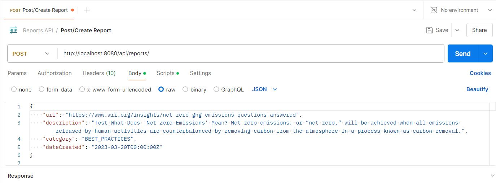
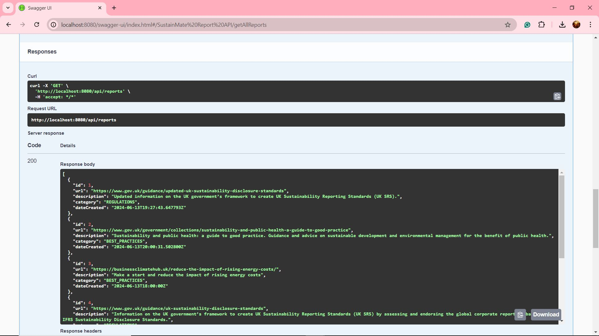

### SustainMate :herb:

Empower individuals across all industries to collaboratively build and share knowledge on sustainability, fostering a global community dedicated to environmental stewardship and positive change. :handshake:

## <u>Report page API</u>

The SustainMate Report API provides endpoints for managing and fetching reports related to sustainability, focusing on regulations, corporate initiatives, and best practices in the UK.

<!-- TABLE OF CONTENTS -->
<details>
  <summary>Table of Contents</summary>
  <ol>
    <li>
      <a href="#prerequisites">Prerequisites</a>
    </li>
    <li>
      <a href="#setup">Setup</a>
    </li>
    <li>
      <a href="#installation">Installation</a>
    </li>
    <li>
      <a href="#usage">Usage</a>
    </li>
    <li>
      <a href="#running-the-application">Running the Application</a>
    </li>
    <li>
      <a href="#api-endpoints-documentation">API Endpoints Documentation</a>
    </li>
    <li>
      <a href="#project-structure">Project Structure</a>
    </li>
    <li>
      <a href="#contributing">Contributing</a>
    </li>
    <li>
      <a href="#credits">Credits</a>
    </li>
    <li>
      <a href="#license">License</a>
    </li>
  </ol>
</details>

### <u>Prerequisites</u>

Ensure the following elements are installed:

1. [JDK 21](https://learn.microsoft.com/en-gb/java/openjdk/download#openjdk-21) (or higher)

2. [Maven 3.9](https://maven.apache.org/download.cgi) (or higher)

3. [Git](https://git-scm.com/downloads)

4. [MySQL 8](https://dev.mysql.com/doc/refman/8.4/en/installing.html) (or higher)

5. [Visual Studio Code](https://code.visualstudio.com/Download)
    1. [Extension Pack for Java](https://marketplace.visualstudio.com/items?itemName=vscjava.vscode-java-pack)
    2. [Spring Boot Extension Pack](https://marketplace.visualstudio.com/items?itemName=vmware.vscode-boot-dev-pack)

### <u>Setup</u>

1. Clone the repository:

    `git clone https://github.com/Gwewe/SustainMate-Report_java-api-assessment.git`

2. Navigate to the project directory:

        cd SustainMate-Report_java-api-assessment

3. Update `application.properties` file with your database configurations (or create a local properties for secure your credentials): 

    ```properties
    spring.datasource.url=jdbc:mysql://localhost:3306/the_name_of_your_database
    spring.datasource.username=your_username spring.datasource.password=your_password 
    ```

4. Configure your database:

    ```sql 
        CREATE DATABASE the_name_of_your_database_name; 
    ```

### <u>Installation</u>

5. To install dependencies:

        ./mvnw clean dependency:resolve


### <u>Usage</u>

---
### *Features*


- **CRUD operations for sustainability reports** : create, read, update and delete reports.

- **Search with a Keyword and Retrieve Data**: Users can search for reports using a keyword. The search will return a list of reports that match the keyword.

- **Find Reports based on their Category**: Users can retrieve reports based on specific categories such as UK Sustainability Regulations(`REGULATIONS`), Corporate Sustainability Initiatives (`CORPORATE_INITIATIVES`), and Case Studies and Best Practices (`BEST_PRACTICES`).

- **Swagger UI for API documentation and testing**


### *Categories*


1. [UK Sustainability Regulation](http://localhost:8080/api/reports/category/REGULATIONS) : Information on UK government regulations and standards related to sustainability.

2. [UK Corporate Sustainability Initiatives](http://localhost:8080/api/reports/category/CORPORATE_INITIATIVES): Examples of sustainability initiatives by companies in the UK.

3. [UK Case Studies and Best Practices](http://localhost:8080/api/reports/category/BEST_PRACTICES): Detailed case studies and best practices in sustainability within the UK.


### <u>Running the Application</u>

1. Start the application:

        ./mvnw spring-boot:run


2. Verify the creation of the reports table:

    ```sql
        USE the_name_of_your_database;
        DESCRIBE reports;
    ```


3. Database Data Sample:

To help you get started with the SustainMate Report API, here are some sample reports:

```sql
        USE the_name_of_your_database;
        INSERT INTO reports (url, description, category, dateCreated) VALUES
        ('https://www.gov.uk/guidance/updated-uk-sustainability-disclosure-standards', 'Updated information on the UK government’s framework to create UK Sustainability Reporting Standards (UK SRS).', 'REGULATIONS', '2024-06-13 19:27:43'),
        ('https://www.gov.uk/government/collections/sustainability-and-public-health-a-guide-to-good-practice', 'Sustainability and public health: a guide to good practice. Guidance and advice on sustainable development and environmental management for the benefit of public health.', 'BEST_PRACTICES', '2024-06-13 20:00:31'),
        ('https://businessclimatehub.uk/reduce-the-impact-of-rising-energy-costs/', 'Make a start and reduce the impact of rising energy costs', 'BEST_PRACTICES', '2024-06-13 18:00:00');
```

4. Use Postman to create a new report

Launch Postman if installed and send a POST request to your API endpoint:

```json
    {
        "url": "https://www.wri.org/insights/net-zero-ghg-emissions-questions-answered",
        "description": "What Does 'Net-Zero Emissions' Mean? Net-zero emissions, or “net zero,” will be achieved when all emissions released by human activities are counterbalanced by removing carbon from the atmosphere in a process known as carbon removal.",
        "category": "BEST_PRACTICES",
        "dateCreated": "2023-03-20T00:00:00Z"
    }
```
---


---

### <u>API Endpoints Documentation</u>

Follow this link to [the Swagger UI documentation](http://localhost:8080/swagger-ui/index.html) to explore the API endpoints.

---


    Example of the getAllReports reponse.

---
### <u>Project Structure</u>

    
        src
        └── main
            └── java
                └── com
                    └── cbfacademy
                        └── apiassessment
                            ├──── config
                            │     ├──   OpenAPIConfiguration
                            │
                            ├── report
                            │   ├── Report.java
                            │   ├── Category.java
                            │   ├── ReportRepository.java
                            │   ├── ReportService.java
                            │   ├── ReportServiceImpl.java
                            │   └── ReportController.java
                            ├──── YourProjectApplication.java
                            │
                            ├──── resources
                                ├── application.properties
    


### <u>Contributing</u>

Thank you for considering contributing to this project! 

### How to Contribute

1. **Fork** the repository to your GitHub account.
2. **Create** a new branch for your feature or bug fix.
3. **Commit** your changes.
4. **Push** your branch to your forked repository.
5. **Open** a pull request from your branch to the main repository's `main` branch.


### <u>Credits</u> :leaves:

- Wedna Guirand: Lead Developer
- Report API: API used to fetch and manage reports regarding sustainability in the UK.

### <u>License</u>

The Report API project is licensed under the MIT License.